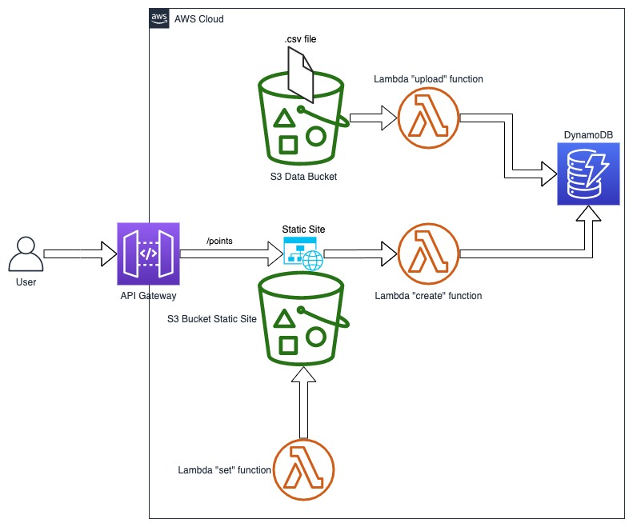
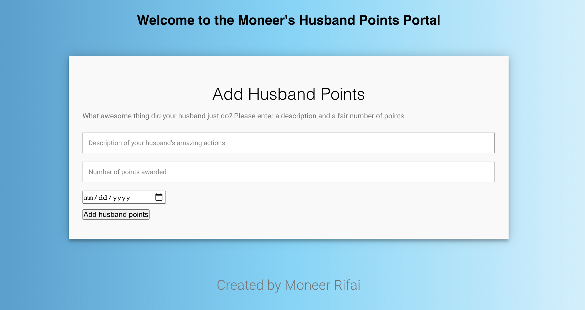

# Husband-Points

Husband-Points is a revolutionary app that is expected to solve the frustrations of millions of husbands and strengthen their marriages to their partners. 

## Background

#### What is This?

I am happily married to my amazing wife Emma, who is wonderful at most things, except for one minor thing: the endless random requests and favors, which can come at any time.

A typical example of a real conversation that we keep having:

Emma: "I need you to run to Target!"

Me: "Sweetie, it is almost 10PM and I'm in my pajamas. Can this wait till tomorrow?"

Emma: "Please please, you'll get tons of husband points if you run this quick errand for me!"

For the longest time, that was her way of encouragin me to do those random tasks. Ater realizing that I probably have amassed thousands of those "husband points", I figured I need a system to manage them!

#### How Does It Work?

The idea is simple: when an unrealistic request is made, a number of points is assigned as an incentive. The value of each request is negotiable and up to the couple. A run to Target at 10PM might be worth 20 points, but spending the weekend with the in-laws could be worth 100 points. You get the idea.

Points can then be redeemed, for example:
- 200 points: work late one night - no questions asked
- 500 points: my choice of restaurant and movie for date night
- 1000 points: spend Christmas with my side of the family 

Entries are submitted through a web portal. An entry consists of a description, the number of points, and the date. All entries are stored in a database.

## Architecture

### Resources Created

This project was built using the Serverless Framework. Upon deployment, the following resources are built:
- three Lambda functions
- two S3 buckets
- an API Gateway
- a DynamoDB table
- all associated roles and policies

When the project is deployed, the following happens:
- A .csv file is uploaded to an S3 bucket (Data S3 bucket)
- The "upload" Lambda function reads the contents of the .csv file and writes them to DynamoDB
- Another Lambda function, known as the "set" Lambda function, creates an index.html file in another S3 bucket (Website S3 bucket) that is set up for static site hosting

### Diagram

The following diagram illustrates the resources described above:



```bash
pip install foobar
```

## Usage

### Prerequisites
To deploy this project, the Serverless Framework is required.

### Deploying 

After downloading the project, navigate to the **husband-points** directory and run the following command:

```
sls deploy
```
After the resources are deployed, you will find a file called **stack.json** inside the **.build directory**, where you will find the URL of the static site, labeled as **WebsiteURL**.

### Using the Web Portal

The static site deployed by this project is a very simple website to show the functionality of adding entries to the DynamoDB table. 

Simple browse to the site, add an entry, and click "Add husband points". You should see the entry in the DynamoDB table.

See this screenshot for more details:



Click [here](http://husband-points-dev-us-west-1.s3-website-us-west-1.amazonaws.com/index.html) to see a live preview of the static site. 

## Dependencies

This project relies on the following Serverless plugins:

  - custom-serverless-plugin: I wrote this very cleverly-named plugin to automatically invoke the "upload" and "set" Lambda functions upon the last stage of deployment. As mentioned earlier, the "upload" Lambda function reads the contents of the .csv file and write them to Dynamo, while the "set" Lambda function creates the index.html file.

  - serverless-s3-deploy: this plugin loads files into S3 upon deployment.
  - serverless-s3-remover: this plugin empties S3 bucket when the project is removed, because a non-empty S3 bucket will cause the deletion of the bucket to fail

  - serverless-stack-output: this plugin outputs some relevant information to the stack.json file inside .build directory, including the URL of the static site, for convenience.

## Further Improvements

This project is obviously more of a proof-of-concept and not a complete app (despite my bragging about it in the introduction). A number of improvements can be made to both the front end and back end:

- Implementing standard CRUD features
- Implementing authentication
- Securing the API
- Adding CI/CD
- Adding tests
- Improving the front end using a framework like React

## We Are Looking for Investors

Are you an investor looking to make a speedy 10x return? Husband-Points is currently looking for VCs who are excited to be on the ground level of a web app with a social mission that is guaranteed to be a unicorn!

For VC inquiries, please contact moneer.rifai@gmail.com


